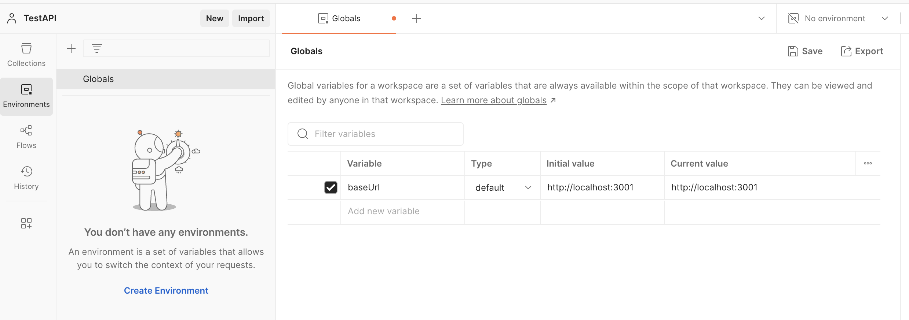
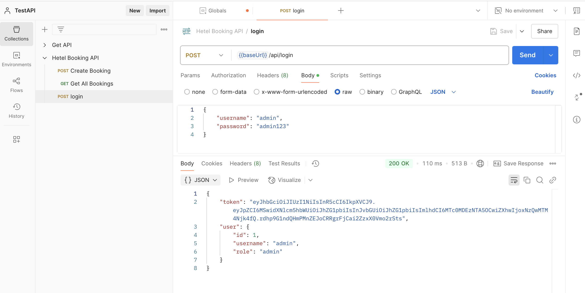
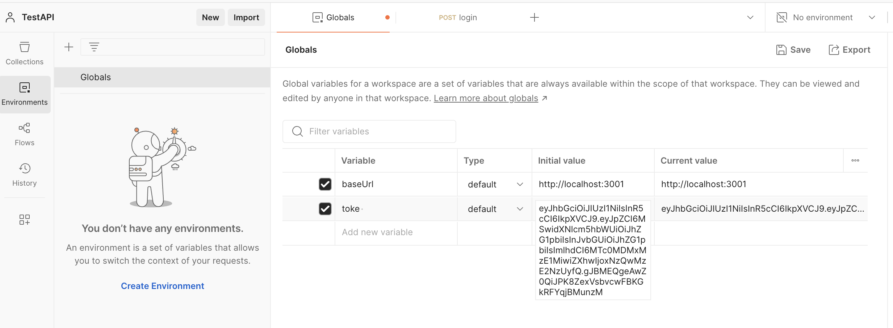
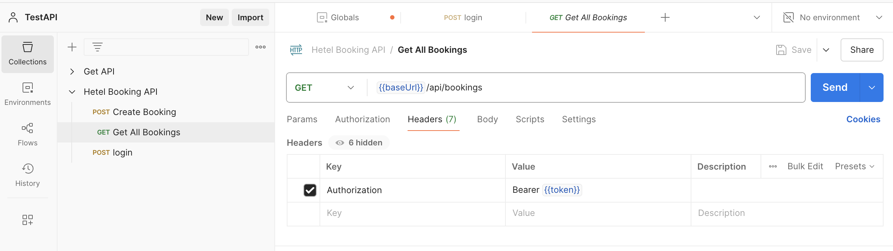
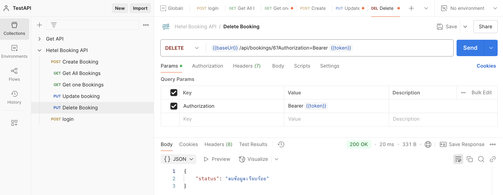
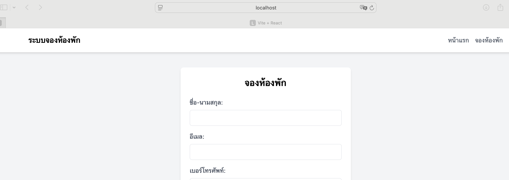

# ใบงานปฏิบัติการ: การพัฒนาระบบจองห้องพักออนไลน์

## วัตถุประสงค์

1. เพื่อเรียนรู้การพัฒนาเว็บแอปพลิเคชันแบบครบวงจร
2. เพื่อเรียนรู้การพัฒนา REST API ด้วย Node.js
3. เพื่อเรียนรู้การพัฒนา Frontend ด้วย React และ Tailwind CSS
4. เพื่อเรียนรู้การจัดการฐานข้อมูลด้วย SQLite
5. เพื่อเรียนรู้การพัฒนาระบบ Authentication

## ทฤษฎีที่เกี่ยวข้องกับการพัฒนาส่วน Back-end

## 1. REST API

REST (Representational State Transfer) เป็นสถาปัตยกรรมการออกแบบ API ที่ใช้หลักการของ HTTP Protocol โดยมีหลักการสำคัญดังนี้:

1. HTTP Methods:

   - GET: ใช้ดึงข้อมูล
   - POST: ใช้สร้างข้อมูลใหม่
   - PUT: ใช้แก้ไขข้อมูล
   - DELETE: ใช้ลบข้อมูล

2. Status Codes:
   - 200: OK
   - 201: Created
   - 400: Bad Request
   - 401: Unauthorized
   - 404: Not Found
   - 500: Internal Server Error

## 2. Node.js และ Express

  Node.js และ Express เป็นเทคโนโลยีที่ได้รับความนิยมอย่างมากในการพัฒนาเว็บแอปพลิเคชันทางฝั่งเซิร์ฟเวอร์ โดยเฉพาะสำหรับการสร้าง REST API

### Node.js คืออะไร?
  Node.js เป็น JavaScript runtime ที่ทำงานนอกเบราว์เซอร์ โดยใช้ Chrome V8 JavaScript engine เป็นตัวประมวลผล ความพิเศษของ Node.js คือ:

   - Non-blocking I/O: รองรับการทำงานแบบ asynchronous ทำให้จัดการงานที่ใช้เวลานานได้โดยไม่ต้องรอ
   - Event-driven: ทำงานตามเหตุการณ์ที่เกิดขึ้น ทำให้จัดการงานหลายอย่างพร้อมกันได้อย่างมีประสิทธิภาพ
   - Package management: มี npm (Node Package Manager) เป็นระบบจัดการแพ็คเกจขนาดใหญ่ที่มีโมดูลมากมายให้ใช้งาน
   - Single-threaded but scalable: ใช้โมเดล single-thread แต่จัดการงานได้มากด้วย event loop

### Express.js คืออะไร?
  Express เป็นเฟรมเวิร์กสำหรับ Node.js ที่ช่วยให้การพัฒนาเว็บแอปพลิเคชันและ API เป็นเรื่องที่ง่ายขึ้น Express มีคุณสมบัติสำคัญดังนี้:
1. Routing ที่มีประสิทธิภาพ
Express มีระบบ routing ที่ยืดหยุ่น ช่วยให้จัดการกับ HTTP requests ได้อย่างมีประสิทธิภาพ:
```jsx
// ตัวอย่างการใช้ routing ใน Express
const express = require('express');
const app = express();

// การกำหนด route แบบพื้นฐาน
app.get('/', (req, res) => {
  res.send('หน้าหลัก');
});

app.get('/about', (req, res) => {
  res.send('เกี่ยวกับเรา');
});

// การใช้ route parameters
app.get('/users/:id', (req, res) => {
  res.send(`ข้อมูลผู้ใช้ ID: ${req.params.id}`);
});

```
2. Middleware
Middleware เป็นฟังก์ชันที่ทำงานระหว่างการรับ request และการส่ง response ช่วยให้จัดการกับข้อมูลและโลจิกต่างๆ ได้ตามต้องการ Express มี middleware สำคัญที่ใช้บ่อย ดังนี้::
```jsx
const express = require('express');
const cors = require('cors');
const bodyParser = require('body-parser');
const app = express();

// CORS - อนุญาตให้เรียกใช้ API จากโดเมนอื่น
app.use(cors());

// Body parsers - แปลงข้อมูลที่ส่งมากับ request
app.use(express.json()); // แปลง JSON request body (ทดแทน body-parser.json())
app.use(express.urlencoded({ extended: true })); // แปลง URL-encoded request body

// Static file serving - ให้บริการไฟล์สถิต เช่น รูปภาพ, CSS, JS
app.use(express.static('public'));

// Cookie parser - อ่านค่า cookies
const cookieParser = require('cookie-parser');
app.use(cookieParser());

// Session middleware - จัดการ session
const session = require('express-session');
app.use(session({
  secret: 'your-secret-key',
  resave: false,
  saveUninitialized: true,
  cookie: { secure: true }
}));
```

3. Error Handling
Express มีกลไกในการจัดการข้อผิดพลาดอย่างเป็นระบบ:
```jsx
// Middleware จัดการข้อผิดพลาด
app.use((err, req, res, next) => {
  console.error(err.stack);
  res.status(500).json({
    error: 'เกิดข้อผิดพลาดบนเซิร์ฟเวอร์',
    message: err.message
  });
});

// จัดการกับ route ที่ไม่มี
app.use((req, res) => {
  res.status(404).json({
    error: 'ไม่พบหน้าที่ต้องการ'
  });
});
```
4. การทำงานกับ Authentication
Express สามารถใช้ jsonwebtoken (JWT) เพื่อจัดการการ authentication


## อุปกรณ์และโปรแกรมที่ใช้

1. Node.js และ npm
2. Visual Studio Code
3. Web Browser 
4. Postman

## การเตรียมสภาพแวดล้อม

### 1. การติดตั้ง Node.js

1. ดาวน์โหลด Node.js จาก https://nodejs.org/
2. เลือกเวอร์ชัน LTS (Long Term Support)
3. ติดตั้งตามขั้นตอน (เลือก "Add to PATH")
4. ตรวจสอบการติดตั้ง:

```bash
node --version
npm --version
```

### 2. การติดตั้ง Visual Studio Code

1. ดาวน์โหลด VS Code จาก https://code.visualstudio.com/
2. ติดตั้งตามขั้นตอน
3. ติดตั้ง Extensions ที่จำเป็น:
   - ES7+ React/Redux/React-Native snippets
   - Tailwind CSS IntelliSense
   - SQLite Viewer

### 3. การติดตั้ง Postman

1. ดาวน์โหลด Postman จาก https://www.postman.com/downloads/
2. ติดตั้งตามขั้นตอน

## ขั้นตอนการทดลอง

## การทดลองที่ 1: การสร้างโครงสร้างโปรเจค

1. สร้างโฟลเดอร์โปรเจค:

```bash
mkdir hotel-booking-system
cd hotel-booking-system
```

2. สร้างโฟลเดอร์สำหรับ backend และ frontend:

```bash
mkdir backend frontend
```

## การทดลองที่ 2: การพัฒนา Backend API

### 2.1 การติดตั้งและตั้งค่าโปรเจค Node.js

1. เข้าไปยังโฟลเดอร์ backend:

```bash
cd backend
```

2. สร้างโปรเจค Node.js:

```bash
npm init -y
```

3. ติดตั้ง dependencies ที่จำเป็น:

```bash
npm install express sqlite3 cors body-parser jsonwebtoken bcryptjs
npm install --save-dev nodemon
```

4. แก้ไขไฟล์ package.json เพิ่ม scripts:

```json
{
  "scripts": {
    "start": "node server.js",
    "dev": "nodemon server.js"
  }
}
```

### 2.2 การสร้างฐานข้อมูล

1. สร้างไฟล์ `database.js`:

```javascript
const sqlite3 = require("sqlite3").verbose();
// เพิ่มข้อมูล admin เริ่มต้น
const bcrypt = require("bcryptjs");
const salt = bcrypt.genSaltSync(10);
const adminPassword = bcrypt.hashSync("admin123", salt);
// สร้างการเชื่อมต่อกับฐานข้อมูล
const db = new sqlite3.Database("bookings.db", (err) => {
  if (err) {
    console.error("เกิดข้อผิดพลาดในการเชื่อมต่อฐานข้อมูล:", err);
  } else {
    console.log("เชื่อมต่อฐานข้อมูลสำเร็จ");
    createTables();
  }
});

// สร้างตารางที่จำเป็น
const createTables = () => {
  // ตาราง users สำหรับเก็บข้อมูลผู้ใช้
  db.run(`
        CREATE TABLE IF NOT EXISTS users (
            id INTEGER PRIMARY KEY AUTOINCREMENT,
            username TEXT UNIQUE NOT NULL,
            password TEXT NOT NULL,
            role TEXT NOT NULL,
            created_at TIMESTAMP DEFAULT CURRENT_TIMESTAMP
        )
    `);

  // ตาราง bookings สำหรับเก็บข้อมูลการจอง
  db.run(`
        CREATE TABLE IF NOT EXISTS bookings (
            id INTEGER PRIMARY KEY AUTOINCREMENT,
            fullname TEXT NOT NULL,
            email TEXT NOT NULL,
            phone TEXT NOT NULL,
            checkin DATE NOT NULL,
            checkout DATE NOT NULL,
            roomtype TEXT NOT NULL,
            guests INTEGER NOT NULL,
            status TEXT DEFAULT 'pending',
            comment TEXT,
            created_at TIMESTAMP DEFAULT CURRENT_TIMESTAMP
        )
    `);

  db.run(
    `
        INSERT OR IGNORE INTO users (username, password, role)
        VALUES ('admin', ?, 'admin')
    `,
    [adminPassword]
  );
};

module.exports = db;
```

### 2.3 การสร้าง API Endpoints

1. สร้างไฟล์ `server.js`:

```javascript
const express = require("express");
const cors = require("cors");
const bodyParser = require("body-parser");
const jwt = require("jsonwebtoken");
const bcrypt = require("bcryptjs");
const db = require("./database");

const app = express();
const port = 3001; // เปลี่ยนเป็น port 3001
const JWT_SECRET = "your-secret-key"; // ในการใช้งานจริงควรเก็บไว้ใน environment variable

// Middleware
app.use(cors());
app.use(bodyParser.json());

// Middleware ตรวจสอบ token
const authenticateToken = (req, res, next) => {
  const authHeader = req.headers["authorization"];
  const token = authHeader && authHeader.split(" ")[1];

  if (!token) {
    return res.status(401).json({ error: "กรุณาเข้าสู่ระบบ" });
  }

  jwt.verify(token, JWT_SECRET, (err, user) => {
    if (err) {
      return res.status(403).json({ error: "Token ไม่ถูกต้องหรือหมดอายุ" });
    }
    req.user = user;
    next();
  });
};

// Login endpoint
app.post("/api/login", async (req, res) => {
  const { username, password } = req.body;

  try {
    // ดึงข้อมูลผู้ใช้
    db.get(
      "SELECT * FROM users WHERE username = ?",
      [username],
      async (err, user) => {
        if (err) {
          return res.status(500).json({ error: err.message });
        }
        if (!user) {
          return res
            .status(401)
            .json({ error: "ชื่อผู้ใช้หรือรหัสผ่านไม่ถูกต้อง" });
        }

        // ตรวจสอบรหัสผ่าน
        const validPassword = await bcrypt.compare(password, user.password);
        if (!validPassword) {
          return res
            .status(401)
            .json({ error: "ชื่อผู้ใช้หรือรหัสผ่านไม่ถูกต้อง" });
        }

        // สร้าง token
        const token = jwt.sign(
          { id: user.id, username: user.username, role: user.role },
          JWT_SECRET,
          { expiresIn: "1h" }
        );

        res.json({
          token,
          user: {
            id: user.id,
            username: user.username,
            role: user.role,
          },
        });
      }
    );
  } catch (err) {
    res.status(500).json({ error: err.message });
  }
});

// Booking endpoints
// สร้างการจองใหม่
app.post("/api/bookings", async (req, res) => {
  const { fullname, email, phone, checkin, checkout, roomtype, guests } =
    req.body;

  const sql = `INSERT INTO bookings (fullname, email, phone, checkin, checkout, roomtype, guests)
                 VALUES (?, ?, ?, ?, ?, ?, ?)`;

  db.run(
    sql,
    [fullname, email, phone, checkin, checkout, roomtype, guests],
    function (err) {
      if (err) {
        return res.status(400).json({ error: err.message });
      }

      db.get(
        "SELECT * FROM bookings WHERE id = ?",
        [this.lastID],
        (err, row) => {
          if (err) {
            return res.status(400).json({ error: err.message });
          }
          res.status(201).json(row);
        }
      );
    }
  );
});

// ดึงข้อมูลการจองทั้งหมด (ต้องมีข้อมูลการ login)
app.get("/api/bookings", authenticateToken, (req, res) => {
  const sql = "SELECT * FROM bookings ORDER BY created_at DESC";

  db.all(sql, [], (err, rows) => {
    if (err) {
      return res.status(400).json({ error: err.message });
    }
    res.json(rows);
  });
});

// ดึงข้อมูลการจองตาม ID (ต้องมีข้อมูลการ login)
app.get("/api/bookings/:id", authenticateToken, (req, res) => {
  const sql = "SELECT * FROM bookings WHERE id = ?";

  db.get(sql, [req.params.id], (err, row) => {
    if (err) {
      return res.status(400).json({ error: err.message });
    }
    if (!row) {
      return res.status(404).json({ error: "ไม่พบข้อมูลการจอง" });
    }
    res.json(row);
  });
});

// อัพเดตข้อมูลการจอง (ต้องมีข้อมูฃการ login)
app.put("/api/bookings/:id", authenticateToken, (req, res) => {
  const { fullname, email, phone, checkin, checkout, roomtype, guests } =
    req.body;

  const sql = `UPDATE bookings 
                 SET fullname = ?, email = ?, phone = ?, 
                     checkin = ?, checkout = ?, roomtype = ?, guests = ?
                 WHERE id = ?`;

  db.run(
    sql,
    [
      fullname,
      email,
      phone,
      checkin,
      checkout,
      roomtype,
      guests,
      req.params.id,
    ],
    function (err) {
      if (err) {
        return res.status(400).json({ error: err.message });
      }
      if (this.changes === 0) {
        return res.status(404).json({ error: "ไม่พบข้อมูลการจอง" });
      }

      db.get(
        "SELECT * FROM bookings WHERE id = ?",
        [req.params.id],
        (err, row) => {
          if (err) {
            return res.status(400).json({ error: err.message });
          }
          res.json(row);
        }
      );
    }
  );
});

// ลบข้อมูลการจอง (ต้องมีข้อมูการ login)
app.delete("/api/bookings/:id", authenticateToken, (req, res) => {
  const sql = "DELETE FROM bookings WHERE id = ?";

  db.run(sql, [req.params.id], function (err) {
    if (err) {
      return res.status(400).json({ error: err.message });
    }
    if (this.changes === 0) {
      return res.status(404).json({ error: "ไม่พบข้อมูลการจอง" });
    }
    res.status(204).send();
  });
});

// เริ่ม server
app.listen(port, () => {
  console.log(`Server กำลังทำงานที่ port ${port}`);
});
```

### 2.4 การทดสอบ API ด้วย Postman

1. เปิด Postman และสร้าง Collection ใหม่
2. สร้าง Environment สำหรับเก็บ variables:

   - baseUrl: http://localhost:3000
   - token: (เว้นว่างไว้ก่อน)

3. สร้าง Requests สำหรับทดสอบ:
   3.1 เพิ่ม variable เพื่อใช้งานในการทดสอบ โดยเลือกที่ Environments -> Globals
   ทำการเพิ่มชื่อ Variable เป็น baseUrl และกำหนดค่า Initial value เป็น http://localhost:3001 ดังรูป
   

3.2 สร้าง request เพื่อทดสอบ Login ระบุ Url คือ POST: {{baseUrl}}/api/login ดังรูป

```json
{
  "username": "admin",
  "password": "password123"
}
```



4. เพิ่ม variable ชื่อ token โดยคัดลอก token ที่ได้จากขั้นตอนการ Login
   

5. สร้าง request เพื่อทดสอบเพิ่มข้อมูลการจอง ระบุ Url คือ POST: {{baseUrl}}/api/bookings โดยระบุข้อมูลดังนี้

```json
{
  "fullname": "ทดสอบ ระบบ โดย [ชื่อนักศึกษา]",
  "email": "test@example.com",
  "phone": "0812345678",
  "checkin": "2024-02-20",
  "checkout": "2024-02-22",
  "roomtype": "standard",
  "guests": 2
}
```

ทำการเพิ่มข้อมูลเพิ่มเติมอย่างน้อย 2 ข้อมูล

6.สร้าง request เพื่อ Get All Bookings ระบุ Url คือ GET: {{baseUrl}}/api/bookings โดยระบุ Headers

- Headers: Authorization: Bearer {{token}}
- กำหนด initial value กับ current value
- กดปุ่ม Save เพื่อบันทึกข้อมูล
  

### บันทึกผลลัพธ์การ Get ข้อมูล


### กรณีผลลัพธ์แจ้ง "error":"Token ไม่ถูกต้องหรือหมดอายุ" ให้ทำการ Login ใหม่ แล้วคัดลอก Token ที่ได้เพื่อเปลี่ยนค่าใน variable token

7. สร้าง request เพื่อ Get Bookings by ID ระบุ Url คือ GET: {{baseUrl}}/api/bookings/1
   - Headers: Authorization: Bearer {{token}}

### /1 คือหมายเลข ID ที่ต้องการ

### บันทึกผลลัพธ์การ Get ข้อมูลโดยระบุ ID


8. สร้าง request เพื่อ Update Booking ระบุ Url คือ PUT: {{baseUrl}}/api/bookings/1
   - Headers: Authorization: Bearer {{token}}
   - เปลี่ยนแปลงแก้ไขข้อมูล fullname, email และคอลัมน์ comment กำหนดให้มีค่าเป็น "Updated by [ชื่อนักศึกษา]"

### /1 คือหมายเลข ID ที่ต้องการแก้ไขข้อมูล

### 8.1 comment จะยังไม่ถูกปรับปรุงแก้ไข ให้ทำการแก้ไขโค้ดส่วนของการ update แล้วรันโปรแกรมใหม่อีกครั้งเพื่อทดสอบการแก้ไข

### บันทึกผลลัพธ์การ PUT เพื่อแก้ไขข้อมูล (ข้อมูล comment จะต้องไม่เป็นค่า null)


9. สร้าง request เพื่อ Delete Booking ระบุ Url คือ DELETE: {{baseUrl}}/api/bookings/1
   - Headers: Authorization: Bearer {{token}}

### บันทึกผลลัพธ์การ DELETE


9.1 ปรับปรุงแก้ไขโค้ดเพื่อให้แสดงผลการลบเป็น status : "ลบข้อมูลสำเร็จโดย [ชื่อนักศึกษา]"
ดังรูป


### บันทึกผลลัพธ์การ DELETE with status


## ทฤษฎีที่เกี่ยวข้องกับการพัฒนาส่วน Front-end ด้วย React
### 1. React
React เป็น JavaScript Library ที่พัฒนาโดย Facebook ใช้สำหรับสร้าง User Interface (UI) โดยมีแนวคิดหลักคือการแบ่ง UI ออกเป็นส่วนย่อยๆ เรียกว่า Components

### หลักการสำคัญของ React:

1. Component-Based
```javascript
// ตัวอย่าง Component
function Button(props) {
    return <button>{props.text}</button>;
}

function App() {
    return (
        <div>
            <Button text="Click me!" />
            <Button text="Submit" />
        </div>
    );
}
```

2. Declarative Programming
```javascript
// แบบ Imperative (การเขียนแบบเดิม)
const button = document.createElement('button');
button.innerHTML = 'Click me!';
button.onclick = () => alert('Clicked!');
document.body.appendChild(button);

// แบบ Declarative (React)
function Button() {
    return (
        <button onClick={() => alert('Clicked!')}>
            Click me!
        </button>
    );
}
```

3. One-Way Data Flow
```javascript
// Parent Component ส่งข้อมูลผ่าน props
function Parent() {
    const [count, setCount] = useState(0);
    return <Child count={count} onIncrement={() => setCount(count + 1)} />;
}

// Child Component รับข้อมูลและ callback
function Child({ count, onIncrement }) {
    return (
        <div>
            Count: {count}
            <button onClick={onIncrement}>+1</button>
        </div>
    );
}
```

### วิวัฒนาการของ React:

1. Class Components (แบบเดิม):
```javascript
class Counter extends React.Component {
    constructor(props) {
        super(props);
        this.state = { count: 0 };
    }

    componentDidMount() {
        console.log('Component mounted');
    }

    incrementCount = () => {
        this.setState({ count: this.state.count + 1 });
    }

    render() {
        return (
            <div>
                Count: {this.state.count}
                <button onClick={this.incrementCount}>+1</button>
            </div>
        );
    }
}
```

2. Function Components with Hooks (แบบใหม่):
```javascript
function Counter() {
    const [count, setCount] = useState(0);

    useEffect(() => {
        console.log('Component mounted');
    }, []);

    return (
        <div>
            Count: {count}
            <button onClick={() => setCount(count + 1)}>+1</button>
        </div>
    );
}
```

### การจัดการ State ใน React:

1. Local State (state ภายใน component):
```javascript
function Form() {
    const [name, setName] = useState('');
    return <input value={name} onChange={e => setName(e.target.value)} />;
}
```

2. Lifting State Up (ยกระดับ state ขึ้นไป parent):
```javascript
function Parent() {
    const [shared, setShared] = useState('');
    return (
        <>
            <ChildA shared={shared} setShared={setShared} />
            <ChildB shared={shared} />
        </>
    );
}
```

3. Global State (state ที่ใช้ร่วมกันทั้งแอพ):
```javascript
// สร้าง Context
const AppContext = createContext();

// Provider Component
function AppProvider({ children }) {
    const [globalState, setGlobalState] = useState({});
    return (
        <AppContext.Provider value={{ globalState, setGlobalState }}>
            {children}
        </AppContext.Provider>
    );
}
```

### Virtual DOM ใน React:

1. การทำงานของ Virtual DOM:
```javascript
// React สร้าง Virtual DOM จาก JSX
const element = (
    <div>
        <h1>Hello</h1>
        <p>World</p>
    </div>
);

// Virtual DOM (ตัวอย่างโครงสร้างภายใน)
const virtualDOM = {
    type: 'div',
    props: {
        children: [
            { type: 'h1', props: { children: 'Hello' } },
            { type: 'p', props: { children: 'World' } }
        ]
    }
};
```

2. การ Update UI:
```javascript
function Counter() {
    const [count, setCount] = useState(0);
    
    // เมื่อ state เปลี่ยน:
    // 1. React สร้าง Virtual DOM ใหม่
    // 2. เปรียบเทียบกับ Virtual DOM เดิม
    // 3. อัพเดตเฉพาะส่วนที่เปลี่ยนแปลงใน Real DOM
    
    return <div>{count}</div>;
}
```

### ข้อดีของ React:

1. Component Reusability:
```javascript
// สร้าง component ครั้งเดียว ใช้ได้หลายที่
function Button({ color, text, onClick }) {
    return (
        <button 
            style={{ backgroundColor: color }}
            onClick={onClick}
        >
            {text}
        </button>
    );
}

// นำไปใช้หลายที่
<Button color="blue" text="Save" onClick={handleSave} />
<Button color="red" text="Delete" onClick={handleDelete} />
```

2. Development Efficiency:
```javascript
// แยก UI เป็นส่วนๆ ทำให้พัฒนาและดูแลง่าย
function App() {
    return (
        <div>
            <Header />
            <Sidebar />
            <MainContent />
            <Footer />
        </div>
    );
}
```

## React Hooks 
React Hooks เป็นฟังก์ชันพิเศษที่ช่วยให้จัดการกับ state และ lifecycle ในคอมโพเนนต์แบบ function component ทำให้โค้ดสั้น กระชับ และนำกลับมาใช้ใหม่ได้ง่าย

### 1. useState Hook
เปรียบเสมือน: สมุดจดบันทึกที่มีปากกาคู่กัน

#### ลักษณะการทำงาน:
- สมุด (state) เก็บข้อมูล
- ปากกา (setState) ใช้แก้ไขข้อมูล

#### ตัวอย่างการใช้งาน:
```javascript
// แบบไม่ใช้ useState
let username = "John";
function updateUsername(newName) {
    username = newName;
    // ต้องเขียนโค้ดเพิ่มเพื่อให้ React รู้ว่าข้อมูลเปลี่ยน
}

// แบบใช้ useState
const [username, setUsername] = useState("John");
// setUsername จะอัพเดทค่าและบอก React ให้ render ใหม่
```

#### การประยุกต์ใช้ในระบบจองห้องพัก:
```javascript
const [formData, setFormData] = useState({
    fullname: '',
    email: '',
    phone: '',
    checkin: '',
    checkout: ''
});

// เมื่อผู้ใช้กรอกข้อมูล
setFormData({
    ...formData,
    fullname: "สมชาย ใจดี"
});
```

### 2. useEffect Hook
เปรียบเสมือน: ระบบแจ้งเตือนอัตโนมัติ

#### ลักษณะการทำงาน:
- คอยเฝ้าดูการเปลี่ยนแปลงของข้อมูล
- ทำงานเมื่อมีการเปลี่ยนแปลงที่สนใจ

#### ตัวอย่างการใช้งาน:
```javascript
// แบบไม่ใช้ useEffect
class BookingList extends React.Component {
    componentDidMount() {
        this.fetchBookings();
    }
    componentDidUpdate(prevProps) {
        if (prevProps.date !== this.props.date) {
            this.fetchBookings();
        }
    }
}

// แบบใช้ useEffect
function BookingList() {
    useEffect(() => {
        fetchBookings();
    }, [date]); // [date] คือส่วนที่ระบุให้ทำงานเมื่อ date มีการเปลี่ยนแปลง 
                // ถ้าระบุเป็น [] จะทำงานครั้งเดียวตอนคอมโพเนนต์ถูกสร้าง
}
```

#### การประยุกต์ใช้ในระบบจองห้องพัก:
```javascript
// ดึงข้อมูลการจองเมื่อเปิดหน้าเว็บ
useEffect(() => {
    const fetchBookings = async () => {
        const response = await axios.get('/api/bookings');
        setBookings(response.data);
    };
    fetchBookings();
}, []); // [] = ทำงานครั้งเดียวตอนคอมโพเนนต์ถูกสร้าง
```

### 3. useNavigate Hook
เปรียบเสมือน: ระบบนำทางอัตโนมัติ 

#### ลักษณะการทำงาน:
- เปลี่ยนหน้าเว็บโดยไม่ต้อง refresh
- จัดการการนำทางในแอพพลิเคชัน

#### ตัวอย่างการใช้งาน:
```javascript
// แบบเก่าใช้ withRouter
class LoginPage extends React.Component {
    onLogin() {
        this.props.history.push('/dashboard');
    }
}

// แบบใช้ useNavigate
function LoginPage() {
    const navigate = useNavigate();
    const onLogin = () => {
        navigate('/dashboard');
    };
}
```

### การประยุกต์ใช้ในระบบจองห้องพัก:
```javascript
const navigate = useNavigate();

// หลังจาก login สำเร็จ
const handleLogin = async () => {
    try {
        await loginAPI();
        navigate('/admin/bookings');
    } catch (error) {
        setError('Login failed');
    }
};
```

### 4. useContext Hook
เปรียบเสมือน: ระบบประกาศข่าวสารส่วนกลาง

### ลักษณะการทำงาน:
- ส่งข้อมูลถึงทุกคอมโพเนนต์โดยไม่ต้องส่งผ่าน props
- จัดการข้อมูลที่ใช้ร่วมกันทั้งระบบ

### ตัวอย่างการใช้งาน:
```javascript
// สร้าง Context Object สำหรับการจัดการข้อมูลการ authentication ที่สามารถแชร์ระหว่าง components
const AuthContext = createContext();

// Provider Component - Component ที่ห่อหุ้ม children components เพื่อให้เข้าถึงข้อมูลใน context ได้
function AuthProvider({ children }) {
  // สร้าง state สำหรับเก็บข้อมูลผู้ใช้ โดยค่าเริ่มต้นเป็น null (ยังไม่มีการล็อกอิน)
  const [user, setUser] = useState(null);
  
  // ส่งค่า user และ setUser ผ่าน Provider เพื่อให้ components อื่นๆ สามารถเข้าถึงได้
  return (
    <AuthContext.Provider value={{ user, setUser }}>
      {/* แสดง components ลูกทั้งหมดที่อยู่ภายใน AuthProvider */}
      {children}
    </AuthContext.Provider>
  );
}

// ตัวอย่างการใช้งาน Context ใน Component
function UserProfile() {
  // ใช้ useContext hook เพื่อดึงข้อมูลจาก AuthContext
  const { user } = useContext(AuthContext);
  
  // แสดงชื่อผู้ใช้งานจากข้อมูลที่ได้รับจาก Context
  return <div>Welcome {user.name}</div>;
}
```

### การประยุกต์ใช้ในระบบจองห้องพัก:
```javascript
// ใช้เก็บข้อมูลผู้ใช้ที่ login
const { user } = useContext(AuthContext);

// ตรวจสอบสิทธิ์
if (user.role === 'admin') {
    // แสดงเมนูสำหรับผู้ดูแลระบบ
}
```

## เปรียบเทียบการใช้งาน Hooks ต่างๆ

| Hook | หน้าที่หลัก | เปรียบเสมือน | ตัวอย่างการใช้ |
|------|------------|--------------|---------------|
| useState | เก็บและจัดการข้อมูล | สมุดบันทึก | เก็บข้อมูลฟอร์ม |
| useEffect | จัดการ side effects | ระบบแจ้งเตือน | ดึงข้อมูลจาก API |
| useNavigate | นำทางระหว่างหน้า | GPS นำทาง | เปลี่ยนหน้าหลัง login |
| useContext | แชร์ข้อมูลระหว่างคอมโพเนนต์ | ประกาศเสียงตามสาย | เก็บข้อมูลผู้ใช้ |

## ข้อควรระวังในการใช้ Hooks

1. useState:
   - ต้องเรียกใช้ที่ระดับบนสุดของ component เท่านั้น
   - ไม่สามารถเรียกใช้ในเงื่อนไขหรือ loop

2. useEffect:
   - ระวัง dependency array ที่ใส่ไม่ครบ
   - ระวัง infinite loop จากการอัพเดต state ใน useEffect

3. useNavigate:
   - ต้องใช้ภายใต้ Router component
   - ไม่สามารถใช้ใน component ที่ไม่ได้อยู่ใน Router

4. useContext:
   - ต้องมี Provider ครอบ component ที่จะใช้
   - ระวังการ re-render ที่ไม่จำเป็นเมื่อ context value เปลี่ยน

## 2. Tailwind CSS

Tailwind CSS เป็น Utility-First CSS Framework ที่ใช้สร้าง UI โดยใช้ utility classes มาประกอบกัน มีจุดเด่นดังนี้:

1. หลักการทำงาน:

   - ใช้ utility classes เพื่อกำหนด style โดยตรงใน HTML/JSX
   - Classes จะอธิบายลักษณะที่ต้องการ เช่น `bg-blue-500` คือพื้นหลังสีน้ำเงิน
   - รวม classes หลายๆ ตัวเพื่อสร้าง style ที่ต้องการ

2. ประเภทของ Utility Classes:

   - Layout: `container`, `flex`, `grid`, etc.
   - Spacing: `p-4` (padding), `m-2` (margin), etc.
   - Sizing: `w-full` (width), `h-screen` (height), etc.
   - Typography: `text-xl`, `font-bold`, etc.
   - Colors: `text-blue-500`, `bg-white`, etc.
   - Effects: `shadow-md`, `opacity-50`, etc.

3. ตัวอย่าง Classes ที่ใช้บ่อย:

```
// การจัดวาง
flex justify-center items-center  // จัดกึ่งกลางแนวนอนและแนวตั้ง
grid grid-cols-3 gap-4           // Grid 3 คอลัมน์ ระยะห่าง 1rem

// ขนาดและระยะห่าง
w-full max-w-md                  // ความกว้างเต็ม สูงสุด medium
p-4 mx-auto my-2                 // padding 1rem, margin auto ซ้าย-ขวา

// การตกแต่ง
bg-white rounded-lg shadow-md    // พื้นหลังขาว มุมโค้ง เงา
hover:bg-gray-100                // เมื่อ hover เปลี่ยนพื้นหลัง

// Typography
text-lg font-bold text-gray-800  // ขนาดตัวอักษร หนา สีเทาเข้ม
```

## ขั้นตอนการทดลองสร้าง Front-end ด้วย React
### 3.1 การตั้งค่าโปรเจค React
### เปิดหน้าต่าง Terminal ใหม่ โดยไม่ปิด Terminal เดิม ที่รัน REST API Server 
1. สร้างโปรเจค React ด้วย Vite โดยพิมพ์คำสั่งใน terminal ดังนี้:

```bash
cd ../frontend
npm create vite@latest . -- --template react
npm install
npm run dev
```
1.1 กดปุ่ม Ctrl ค้างไว้ แล้วคลิกลิ้ง ที่ http://localhost:เลข Port ที่รัน เพื่อเปิดหน้าเว็บการทำงาน 
#### บันทึกผลการรัน

1.2 กด Ctrl + c เพื่อยกเลิกการทำงาน

2. ติดตั้ง dependencies ที่จำเป็น:

```bash
npm install axios react-router-dom
npm install -D tailwindcss@3 postcss autoprefixer
```
#### axios คืออะไร ?
```html
  axios คืออะไร เขียนคำตอบที่นี่
```
3. ตั้งค่า Tailwind CSS:

```bash
npx tailwindcss init -p
```

3.1 แก้ไขไฟล์ `tailwind.config.js`:

```javascript
/** @type {import('tailwindcss').Config} */
export default {
  content: ["./index.html", "./src/**/*.{js,ts,jsx,tsx}"],
  theme: {
    extend: {},
  },
  plugins: [],
};
```

3.2 แก้ไขไฟล์ `src/index.css` โดยลบข้อมูลทั้งหมด และแทนที่ด้วย:

```css
@tailwind base;
@tailwind components;
@tailwind utilities;
```

### 3.2 การสร้าง Components ต่าง ๆ

 สร้างโฟลเดอร์ compenents และ contexts ภายใต้โฟลเดอร์ src เพื่อแยกเก็บไฟล์ต่าง ๆ:

```bash
mkdir -p src/components src/contexts
```
### 3.2.1 App Component
1) แก้ไขไฟล์ `src/App.jsx` โดยลบข้อมูลทั้งหมดแล้วแทนที่ด้วยโค้ดดังนี้:

```jsx
import React from "react";
import { BrowserRouter as Router, Routes, Route, Link } from "react-router-dom";
import BookingForm from "./components/BookingForm";

function App() {
  return (
      <Router>
        <div className="min-h-screen bg-gray-100">
          {/* Navigation */}
          <nav className="bg-white shadow-md">
            <div className="container mx-auto px-4">
              <div className="flex justify-between items-center h-16">
                <Link to="/" className="text-xl font-bold">
                  ระบบจองห้องพัก
                </Link>
                <div className="space-x-4">
                  <Link to="/" className="text-gray-600 hover:text-gray-900">
                    หน้าแรก
                  </Link>
                  <Link
                    to="/booking"
                    className="text-gray-600 hover:text-gray-900"
                  >
                    จองห้องพัก
                  </Link>
                </div>
              </div>
            </div>
          </nav>

          {/* Routes */}
          <Routes>
            <Route path="/" element={<HomePage />} />
            <Route path="/booking" element={<BookingForm />} />
          </Routes>  
        </div>
      </Router>

  );
}

// HomePage component
const HomePage = () => (
  <div className="container mx-auto px-4 py-8">
    <h1 className="text-4xl font-bold text-center mb-8">
      ยินดีต้อนรับสู่ระบบจองห้องพัก
    </h1>
    <div className="text-center">
      <Link
        to="/booking"
        className="inline-block bg-blue-500 text-white px-6 py-3 rounded-lg hover:bg-blue-600"
      >
        จองห้องพักเลย
      </Link>
    </div>
  </div>
);

export default App;
```
2) ทดสอบรัน โดยพิมพ์คำสั่ง npm run dev แล้วบันทึกหน้าผลการรัน
#### บันทึกรูปผลการรัน


3) กดปุ่ม Ctrl ค้างไว้ แล้วคลิกลิ้ง ที่ http://localhost:เลข Port ที่รัน เพื่อเปิดหน้าเว็บการทำงาน แล้วตรวจสอบ error โดยไม่ต้องหยุดการทำงานของ Application
#### บันทึกผลการรัน
```html
บันทึกสาเหตุที่ทำให้เกิด error ที่นี่
```
### 3.2.2 BookingForm Component
1) สร้างไฟล์ `src/components/BookingForm.jsx`:

```jsx
import React, { useState } from "react";
import axios from "axios";

const BookingForm = () => {
  const [formData, setFormData] = useState({
    fullname: "",
    email: "",
    phone: "",
    checkin: "",
    checkout: "",
    roomtype: "",
    guests: 1,
  });
  const [error, setError] = useState("");
  const [success, setSuccess] = useState("");

  const maxGuests = {
    standard: 2,
    deluxe: 3,
    suite: 4,
  };

  const handleChange = (e) => {
    const { name, value } = e.target;
    setFormData((prev) => ({ ...prev, [name]: value }));
  };

  const handleSubmit = async (e) => {
    e.preventDefault();
    setError("");
    setSuccess("");

    try {
      // ตรวจสอบข้อมูล
      const checkin = new Date(formData.checkin);
      const checkout = new Date(formData.checkout);
      const today = new Date();
      today.setHours(0, 0, 0, 0);

      if (checkin < today) {
        setError("กรุณาเลือกวันเช็คอินที่ยังไม่ผ่านมา");
        return;
      }

      if (checkout <= checkin) {
        setError("วันเช็คเอาท์ต้องมาหลังวันเช็คอิน");
        return;
      }

      const phoneRegex = /^[0-9]{10}$/;
      if (!phoneRegex.test(formData.phone)) {
        setError("กรุณากรอกเบอร์โทรศัพท์ให้ถูกต้อง (10 หลัก)");
        return;
      }

      // คำนวณจำนวนวันที่พัก
      const days = Math.ceil((checkout - checkin) / (1000 * 60 * 60 * 24));

      // แสดงสรุปการจอง
      const roomTypes = {
        standard: "ห้องมาตรฐาน",
        deluxe: "ห้องดีลักซ์",
        suite: "ห้องสวีท",
      };

      const summary = `
        สรุปการจอง:
        - ชื่อผู้จอง: ${formData.fullname}
        - ประเภทห้อง: ${roomTypes[formData.roomtype]}
        - วันที่เข้าพัก: ${checkin.toLocaleDateString("th-TH")}
        - วันที่ออก: ${checkout.toLocaleDateString("th-TH")}
        - จำนวนวันที่พัก: ${days} วัน
        - จำนวนผู้เข้าพัก: ${formData.guests} ท่าน
      `;

      if (window.confirm(summary + "\n\nยืนยันการจองห้องพัก?")) {
        await axios.post("http://localhost:3001/api/bookings", formData);
        setSuccess("จองห้องพักเรียบร้อยแล้ว");
        setFormData({
          fullname: "",
          email: "",
          phone: "",
          checkin: "",
          checkout: "",
          roomtype: "",
          guests: 1,
        });
      }
    } catch (err) {
      setError(err.response?.data?.error || "เกิดข้อผิดพลาดในการจองห้องพัก");
    }
  };

  return (
    <div className="max-w-md mx-auto mt-10 p-6 bg-white rounded-lg shadow-md">
      <h2 className="text-2xl font-bold mb-6 text-center">จองห้องพัก</h2>

      {error && (
        <div className="bg-red-100 border border-red-400 text-red-700 px-4 py-3 rounded mb-4">
          {error}
        </div>
      )}

      {success && (
        <div className="bg-green-100 border border-green-400 text-green-700 px-4 py-3 rounded mb-4">
          {success}
        </div>
      )}

      <form onSubmit={handleSubmit} className="space-y-4">
        {/* ตัวอย่างการใช้ Tailwind ใน input group */}
        <div>
          <label className="block text-gray-700 mb-2">ชื่อ-นามสกุล:</label>
          <input
            type="text"
            name="fullname"
            value={formData.fullname}
            onChange={handleChange}
            className="w-full p-2 border rounded-md focus:ring-2 focus:ring-blue-500"
            required
          />
        </div>

        <div>
          <label className="block text-gray-700 mb-2">อีเมล:</label>
          <input
            type="email"
            name="email"
            value={formData.email}
            onChange={handleChange}
            className="w-full p-2 border rounded-md focus:ring-2 focus:ring-blue-500"
            required
          />
        </div>

        <div>
          <label className="block text-gray-700 mb-2">เบอร์โทรศัพท์:</label>
          <input
            type="tel"
            name="phone"
            value={formData.phone}
            onChange={handleChange}
            className="w-full p-2 border rounded-md focus:ring-2 focus:ring-blue-500"
            required
          />
        </div>

        <div>
          <label className="block text-gray-700 mb-2">วันที่เช็คอิน:</label>
          <input
            type="date"
            name="checkin"
            value={formData.checkin}
            onChange={handleChange}
            min={new Date().toISOString().split("T")[0]}
            className="w-full p-2 border rounded-md focus:ring-2 focus:ring-blue-500"
            required
          />
        </div>

        <div>
          <label className="block text-gray-700 mb-2">วันที่เช็คเอาท์:</label>
          <input
            type="date"
            name="checkout"
            value={formData.checkout}
            onChange={handleChange}
            min={formData.checkin}
            className="w-full p-2 border rounded-md focus:ring-2 focus:ring-blue-500"
            required
          />
        </div>

        <div>
          <label className="block text-gray-700 mb-2">ประเภทห้องพัก:</label>
          <select
            name="roomtype"
            value={formData.roomtype}
            onChange={handleChange}
            className="w-full p-2 border rounded-md focus:ring-2 focus:ring-blue-500"
            required
          >
            <option value="">กรุณาเลือกประเภทห้องพัก</option>
            <option value="standard">ห้องมาตรฐาน (สูงสุด 2 ท่าน)</option>
            <option value="deluxe">ห้องดีลักซ์ (สูงสุด 3 ท่าน)</option>
            <option value="suite">ห้องสวีท (สูงสุด 4 ท่าน)</option>
          </select>
        </div>

        <div>
          <label className="block text-gray-700 mb-2">จำนวนผู้เข้าพัก:</label>
          <input
            type="number"
            name="guests"
            value={formData.guests}
            onChange={handleChange}
            min="1"
            max={formData.roomtype ? maxGuests[formData.roomtype] : 1}
            className="w-full p-2 border rounded-md focus:ring-2 focus:ring-blue-500"
            required
          />
        </div>

        <button
          type="submit"
          className="w-full bg-blue-500 text-white py-2 px-4 rounded-md hover:bg-blue-600 transition-colors"
        >
          จองห้องพัก
        </button>
      </form>
    </div>
  );
};

export default BookingForm;
```

### สรุปความหมายของคลาส Tailwind CSS ในโค้ด BookingForm
#### คลาสสำหรับการจัดวางหลักของ component
- `max-w-md`: กำหนดความกว้างสูงสุดของ element เป็นขนาดกลาง (28rem หรือ 448px)
- `mx-auto`: กำหนด margin ด้านซ้ายและขวาเป็น auto เพื่อจัดให้ element อยู่กึ่งกลางแนวนอน
- `mt-10`: กำหนด margin-top เป็น 2.5rem (40px) เพื่อเว้นระยะห่างด้านบน
- `p-6`: กำหนด padding ทุกด้านเป็น 1.5rem (24px)

#### คลาสสำหรับสีพื้นหลังและการตกแต่ง
- `bg-white`: กำหนดสีพื้นหลังเป็นสีขาว
- `rounded-lg`: ทำให้มุมมน (border-radius) ขนาดใหญ่ (0.5rem หรือ 8px)
- `shadow-md`: เพิ่มเงาขนาดกลางรอบ element

#### คลาสสำหรับข้อความและส่วนหัว
- `text-2xl`: กำหนดขนาดอักษรเป็น 1.5rem (24px)
- `font-bold`: กำหนดความหนาของตัวอักษรเป็นแบบตัวหนา
- `mb-6`: กำหนด margin-bottom เป็น 1.5rem (24px)
- `text-center`: จัดข้อความให้อยู่ตรงกลาง
- `text-gray-700`: กำหนดสีของข้อความเป็นสีเทาเข้ม
- `text-red-700`: กำหนดสีของข้อความเป็นสีแดงเข้ม (สำหรับข้อความแจ้งเตือน)
- `text-green-700`: กำหนดสีของข้อความเป็นสีเขียวเข้ม (สำหรับข้อความสำเร็จ)

#### คลาสสำหรับการแสดงข้อความแจ้งเตือน
- `bg-red-100`: กำหนดสีพื้นหลังเป็นสีแดงอ่อน
- `border`: เพิ่มเส้นขอบรอบ element
- `border-red-400`: กำหนดสีของเส้นขอบเป็นสีแดงปานกลาง
- `px-4`: กำหนด padding ด้านซ้ายและขวาเป็น 1rem (16px)
- `py-3`: กำหนด padding ด้านบนและล่างเป็น 0.75rem (12px)
- `rounded`: ทำให้มุมมน (border-radius)
- `mb-4`: กำหนด margin-bottom เป็น 1rem (16px)

#### คลาสสำหรับข้อความแจ้งความสำเร็จ
- `bg-green-100`: กำหนดสีพื้นหลังเป็นสีเขียวอ่อน
- `border-green-400`: กำหนดสีของเส้นขอบเป็นสีเขียวปานกลาง

#### คลาสสำหรับการจัดวางฟอร์ม
- `space-y-4`: กำหนดระยะห่างแนวตั้งระหว่าง child elements เป็น 1rem (16px)
- `block`: ทำให้ element แสดงเป็นแบบ block (ขึ้นบรรทัดใหม่)
- `mb-2`: กำหนด margin-bottom เป็น 0.5rem (8px)

#### คลาสสำหรับฟิลด์อินพุต
- `w-full`: กำหนดความกว้างเป็น 100% ของ parent element
- `p-2`: กำหนด padding ทุกด้านเป็น 0.5rem (8px)
- `border`: เพิ่มเส้นขอบรอบ element
- `rounded-md`: ทำให้มุมมน (border-radius) ขนาดกลาง (0.375rem หรือ 6px)
- `focus:ring-2`: เพิ่ม ring (outline) ขนาด 2px เมื่อ element ได้รับ focus
- `focus:ring-blue-500`: กำหนดสีของ ring เป็นสีฟ้าเข้ม

#### คลาสสำหรับปุ่ม
- `bg-blue-500`: กำหนดสีพื้นหลังเป็นสีฟ้าเข้ม
- `text-white`: กำหนดสีข้อความเป็นสีขาว
- `py-2`: กำหนด padding ด้านบนและล่างเป็น 0.5rem (8px)
- `px-4`: กำหนด padding ด้านซ้ายและขวาเป็น 1rem (16px)
- `hover:bg-blue-600`: เปลี่ยนสีพื้นหลังเป็นสีฟ้าเข้มขึ้นเมื่อเม้าส์ hover
- `transition-colors`: สร้าง transition effect เมื่อมีการเปลี่ยนแปลงสี


2) กดเลือกเมนู "จองห้องพัก" หรือปุ่ม "จองห้องพักเลย" หากหน้าเว็บไม่แสดงหน้าฟอร์มการจองห้องพัก ให้ลองทำการ refresh หน้าเว็บ เพื่อให้ระบบแสดงหน้าเว็บดังตัวอย่าง


3) ทดสอบป้อนข้อมูลการจอง โดยระบุชื่อผู้จองเป็นชื่อนักศึกษา และบันทึกผลการทดลองที่มีหน้าสรุปการจอง
#### บันทึกผลการทดลอง


4) ใช้ Postman  ตรวจสอบว่ามีข้อมูลการจองเพิ่มไปหรือไม่ (หาก token หมดอายุ ต้องทำการ Login แล้วเปลี่ยนค่า token ใหม่)

### 3.2.3 AuthContext Component
1) สร้างไฟล์ `src/contexts/AuthContext.jsx` เพื่อจัดการข้อมูลการ Login ของผู้ใช้ระบบ:

```jsx
import React, { createContext, useContext, useState, useEffect } from "react";

const AuthContext = createContext(null);

export const AuthProvider = ({ children }) => {
  const [user, setUser] = useState(null);
  const [token, setToken] = useState(null); // เพิ่ม state สำหรับเก็บ token
  const [loading, setLoading] = useState(true);

  useEffect(() => {
    const savedToken = localStorage.getItem("token");
    const savedUser = localStorage.getItem("user");
    if (savedToken && savedUser) {
      setToken(savedToken); // เก็บ token ใน state
      setUser(JSON.parse(savedUser));
    }
    setLoading(false);
  }, []);

  const login = (userData, newToken) => {
    setUser(userData);
    setToken(newToken); // อัปเดต token ใน state
    localStorage.setItem("token", newToken);
    localStorage.setItem("user", JSON.stringify(userData));
  };

  const logout = () => {
    setUser(null);
    setToken(null); // ล้าง token ใน state
    localStorage.removeItem("token");
    localStorage.removeItem("user");
  };

  return (
    <AuthContext.Provider value={{ user, token, login, logout, loading }}>
      {!loading && children}
    </AuthContext.Provider>
  );
};

export const useAuth = () => useContext(AuthContext);
```

### 3.2.4 Login Component
1) สร้างไฟล์ `src/components/Login.jsx` สำหรับหน้า Login และส่งข้อมูล Login ไปยัง Rest API:

```jsx
import React, { useState } from 'react';
// Import useNavigate hook จาก react-router-dom สำหรับการเปลี่ยนหน้าใน React application
// เช่น การ redirect ไปยังหน้าอื่นหลังจาก login สำเร็จ
import { useNavigate } from 'react-router-dom';

// Import axios library สำหรับทำ HTTP requests ไปยัง API
// ใช้สำหรับเรียก API เช่น การส่งข้อมูล login ไปยัง server หรือการดึงข้อมูลจาก server
import axios from 'axios';
import { useAuth } from '../contexts/AuthContext';

const Login = () => {
// Hook สำหรับการนำทางไปยังหน้าต่างๆ
const navigate = useNavigate();

// Hook สำหรับการจัดการ Authentication จาก Context
const { login } = useAuth();

// State สำหรับเก็บข้อมูลฟอร์มล็อกอิน
const [formData, setFormData] = useState({
    username: '',
    password: ''
});

// State สำหรับเก็บข้อความ error
const [error, setError] = useState('');

const handleSubmit = async (e) => {
    e.preventDefault();  // ป้องกันการ refresh หน้า
    setError('');       // ล้างข้อความ error เดิม
    try {
        // ส่งข้อมูลไปยัง API เพื่อล็อกอิน
        const response = await axios.post('http://localhost:3001/api/login', formData);

        // เก็บข้อมูลผู้ใช้และ token ผ่าน Context
        login(response.data.user, response.data.token);

        // นำทางไปยังหน้า admin
        navigate('/admin');
    } catch (err) {
        // จัดการกรณีเกิดข้อผิดพลาด
        setError(err.response?.data?.error || 'เกิดข้อผิดพลาดในการเข้าสู่ระบบ');
    }
};

  return (
    <div className="min-h-screen bg-gray-100 flex items-start justify-center pt-20">
      <div className="max-w-md w-full bg-white rounded-lg shadow-md p-8">
        <h2 className="text-2xl font-bold text-center mb-6">เข้าสู่ระบบ</h2>
        {error && (
            <div className="bg-red-100 border border-red-400 text-red-700 px-4 py-3 rounded mb-4">
                {error}
            </div>
        )}

        <form onSubmit={handleSubmit} className="space-y-4">
          <div>
            <label className="block text-gray-700 mb-2">ชื่อผู้ใช้:</label>
            <input
              type="text"
              value={formData.username}
              onChange={(e) => setFormData({...formData, username: e.target.value})}
              className="w-full p-2 border rounded-md focus:ring-2 focus:ring-blue-500"
              required
            />
          </div>

          <div>
            <label className="block text-gray-700 mb-2">รหัสผ่าน:</label>
            <input
              type="password"
              value={formData.password}
              onChange={(e) => setFormData({...formData, password: e.target.value})}
              className="w-full p-2 border rounded-md focus:ring-2 focus:ring-blue-500"
              required
            />
          </div>

          <button
            type="submit"
            className="w-full bg-blue-500 text-white py-2 px-4 rounded-md hover:bg-blue-600"
          >
            เข้าสู่ระบบ
          </button>
        </form>
      </div>
    </div>
  );
};

export default Login;
```

### 3.2.5 ProtectedRoute Component
1) สร้างไฟล์ `src/components/ProtectedRoute.jsx`:

```jsx
import { Navigate } from "react-router-dom";
import { useAuth } from "../contexts/AuthContext";

const ProtectedRoute = ({ children }) => {
  const { user, loading } = useAuth();

  if (loading) return null;
  if (!user) return <Navigate to="/login" />;

  return children;
};

export default ProtectedRoute;
```

### 3.2.6 BookingList Component
1) สร้างไฟล์ `src/components/BookingList.jsx`:

```jsx
import React, { useState, useEffect } from "react";
import axios from "axios";
import { Link } from "react-router-dom";
import { useAuth } from '../contexts/AuthContext';

const BookingList = () => {
  const [bookings, setBookings] = useState([]);
  const [loading, setLoading] = useState(true);
  const [error, setError] = useState(null);
  const { token } = useAuth(); // ดึง token โดยตรงจาก useAuth
  useEffect(() => {
    fetchBookings();
  }, [token]);

  const fetchBookings = async () => {
    try {
        const response = await axios.get("http://localhost:3001/api/bookings", {
          headers: { Authorization: `Bearer ${token}` }
        });
      setBookings(response.data);
      setLoading(false);
    } catch (err) {
        console.error("Error details:", err);
        setError(`ไม่สามารถดึงข้อมูลการจองได้: ${err.message}`);
        setLoading(false);
    }
  };

  const handleDelete = async (id) => {
    if (window.confirm("คุณต้องการลบข้อมูลการจองนี้ใช่หรือไม่?")) {
      try {
        await axios.delete(`http://localhost:3001/api/bookings/${id}`, {
          headers: { Authorization: `Bearer ${token}` }
        });
        // ดึงข้อมูลใหม่หลังจากลบ
        fetchBookings();
        alert("ลบข้อมูลการจองเรียบร้อยแล้ว");
      } catch (err) {
        alert("เกิดข้อผิดพลาดในการลบข้อมูล");
      }
    }
  };

  if (loading)
    return <div className="text-center py-4">กำลังโหลดข้อมูล...</div>;
  if (error)
    return <div className="text-center py-4 text-red-500">{error}</div>;

  return (
    <div className="container mx-auto px-4 py-8">
      <div className="flex justify-between items-center mb-6">
        <h2 className="text-2xl font-bold">รายการจองห้องพัก</h2>
        <Link
          to="/admin/bookings/new"
          className="bg-green-500 text-white px-4 py-2 rounded hover:bg-green-600"
        >
          เพิ่มการจอง
        </Link>
      </div>

      {bookings.length === 0 ? (
        <p className="text-center py-4">ไม่พบข้อมูลการจอง</p>
      ) : (
        <div className="grid grid-cols-1 md:grid-cols-2 lg:grid-cols-3 gap-4">
          {bookings.map((booking) => (
            <div key={booking.id} className="bg-white p-4 rounded-lg shadow">
              <div className="flex justify-between items-start mb-2">
                <h3 className="font-bold">{booking.fullname}</h3>
                <div className="space-x-2">
                  <Link
                    to={`/admin/bookings/edit/${booking.id}`}
                    className="text-blue-500 hover:text-blue-700"
                  >
                    แก้ไข
                  </Link>
                  <button
                    onClick={() => handleDelete(booking.id)}
                    className="text-red-500 hover:text-red-700"
                  >
                    ลบ
                  </button>
                </div>
              </div>
              <p className="text-gray-600">อีเมล: {booking.email}</p>
              <p className="text-gray-600">เบอร์โทร: {booking.phone}</p>
              <p className="text-gray-600">
                ประเภทห้อง:{" "}
                {booking.roomtype === "standard"
                  ? "ห้องมาตรฐาน"
                  : booking.roomtype === "deluxe"
                  ? "ห้องดีลักซ์"
                  : "ห้องสวีท"}
              </p>
              <p className="text-gray-600">
                วันที่เข้าพัก:{" "}
                {new Date(booking.checkin).toLocaleDateString("th-TH")}
              </p>
              <p className="text-gray-600">
                วันที่ออก:{" "}
                {new Date(booking.checkout).toLocaleDateString("th-TH")}
              </p>
              <p className="text-gray-600">
                จำนวนผู้เข้าพัก: {booking.guests} ท่าน
              </p>
            </div>
          ))}
        </div>
      )}
    </div>
  );
};

export default BookingList;
```
2) แก้ไขไฟล์ App.js ดังนี้
```jsx
import React from "react";
import { BrowserRouter as Router, Routes, Route, Link } from "react-router-dom";
import { AuthProvider } from "./contexts/AuthContext";
import BookingForm from "./components/BookingForm";
import BookingList from "./components/BookingList";
import ProtectedRoute from "./components/ProtectedRoute";
import Login from "./components/Login";

function App() {
  return (
    <AuthProvider>
      <Router>
        <div className="min-h-screen bg-gray-100">
          {/* Navigation */}
          <nav className="bg-white shadow-md">
            <div className="container mx-auto px-4">
              <div className="flex justify-between items-center h-16">
                <Link to="/" className="text-xl font-bold">
                  ระบบจองห้องพัก
                </Link>
                <div className="space-x-4">
                  <Link to="/" className="text-gray-600 hover:text-gray-900">
                    หน้าแรก
                  </Link>
                  <Link
                    to="/booking"
                    className="text-gray-600 hover:text-gray-900"
                  >
                    จองห้องพัก
                  </Link>
                  <Link
                    to="/admin"
                    className="text-gray-600 hover:text-gray-900"
                  >
                    สำหรับผู้ดูแล
                  </Link>
                </div>
              </div>
            </div>
          </nav>

          {/* Routes */}
          <Routes>
            <Route path="/" element={<HomePage />} />
            <Route path="/booking" element={<BookingForm />} />
            <Route path="/login" element={<Login />} />
            <Route
              path="/admin"
              element={
                <ProtectedRoute>
                  <BookingList />
                </ProtectedRoute>
              }
            />
            <Route
              path="/admin/bookings"
              element={
                <ProtectedRoute>
                  <BookingList />
                </ProtectedRoute>
              }
            />

          </Routes>
        </div>
      </Router>
    </AuthProvider>
  );
}

// HomePage component
const HomePage = () => (
  <div className="container mx-auto px-4 py-8">
    <h1 className="text-4xl font-bold text-center mb-8">
      ยินดีต้อนรับสู่ระบบจองห้องพัก
    </h1>
    <div className="text-center">
      <Link
        to="/booking"
        className="inline-block bg-blue-500 text-white px-6 py-3 rounded-lg hover:bg-blue-600"
      >
        จองห้องพักเลย
      </Link>
    </div>
  </div>
);

export default App;
```
3) ทดสอบกดเมนู "สำหรับผู้ดูแลระบบ" จะปรากฎหน้าต่าง Login 
4) ทำการ Login ด้วย user: admin  password: admin123  หากระบบทำงานถูกต้อง จะแสดงรายการจองห้องพัก

### บันทึกผลการทดลอง 

   
   

### 3.2.7 BookingEdit Component

1) สร้างไฟล์ `src/components/BookingEdit.jsx`:

```jsx
import React, { useState, useEffect } from "react";
import { useParams, useNavigate } from "react-router-dom";
import axios from "axios";
import { useAuth } from '../contexts/AuthContext'; //เปลี่ยนวิธีการดึงค่า Token โดย import useAuth

const BookingEdit = () => {
  const { id } = useParams();
  const navigate = useNavigate();
  const { token } = useAuth(); 
  const maxGuests = {
    standard: 2,
    deluxe: 3,
    suite: 4,
  };
  const [formData, setFormData] = useState({
    fullname: "",
    email: "",
    phone: "",
    checkin: "",
    checkout: "",
    roomtype: "",
    guests: 1,
  });
  const [loading, setLoading] = useState(true);

  useEffect(() => {
    fetchBooking();
  }, [id]);

  const fetchBooking = async () => {
    try {
        const response = await axios.get(
            `http://localhost:3001/api/bookings/${id}`,
            {
              headers: { Authorization: `Bearer ${token}` }
            }
          );

      // แปลงวันที่ให้อยู่ในรูปแบบที่ input type="date" ใช้ได้
      const booking = response.data;
      booking.checkin = booking.checkin.split("T")[0];
      booking.checkout = booking.checkout.split("T")[0];
      setFormData(booking);
      setLoading(false);
    } catch (err) {
      alert("ไม่สามารถดึงข้อมูลการจอง");
      navigate("/admin/bookings");
    }
  };

  const handleChange = (e) => {
    const { name, value } = e.target;
    setFormData((prev) => ({ ...prev, [name]: value }));
  };

  if (loading)
    return <div className="text-center py-4">กำลังโหลดข้อมูล...</div>;

  return (
    <div className="max-w-md mx-auto mt-10 p-6 bg-white rounded-lg shadow-md">
      <h2 className="text-2xl font-bold mb-6 text-center">แก้ไขข้อมูลการจอง</h2>
      <form onSubmit={handleSubmit} className="space-y-4">
        {/* ฟอร์มเหมือนกับ BookingForm แต่มีข้อมูลเดิม */}
        <div>
          <label className="block text-gray-700 mb-2">ชื่อ-นามสกุล:</label>
          <input
            type="text"
            name="fullname"
            value={formData.fullname}
            onChange={handleChange}
            className="w-full p-2 border rounded-md focus:ring-2 focus:ring-blue-500"
            required
          />
        </div>

        {/* เพิ่ม fields อื่นๆ เหมือน BookingForm */}

        <div className="flex space-x-4">
          <button
            type="submit"
            className="flex-1 bg-blue-500 text-white py-2 px-4 rounded-md hover:bg-blue-600"
          >
            บันทึก
          </button>
          <button
            type="button"
            onClick={() => navigate("/admin/bookings")}
            className="flex-1 bg-gray-500 text-white py-2 px-4 rounded-md hover:bg-gray-600"
          >
            ยกเลิก
          </button>
        </div>
      </form>
    </div>
  );
};

export default BookingEdit;
```
2) แก้ไขโค้ดตำแหน่ง  {/* เพิ่ม fields อื่นๆ เหมือน BookingForm */} โดยคัดลอกมาจากไฟล์ BookingForm.jsx
3) แก้ไข App.js ดังนี้
   2.1) เพ่ิมการ import BookingEdit
   ```jsx
   import BookingEdit from "./components/BookingEdit";
   ```
   2.2) เพิ่ม route เพื่อสร้างเส้นทางไปยัง BookingEdit
   ```jsx
              <Route
              path="/admin/bookings/edit/:id"
              element={
                <ProtectedRoute>
                  <BookingEdit />
                </ProtectedRoute>
              }
            />
   ```
4) ทดสอบการแก้ไขข้อมูลการจอง โดยกดปุ่ม "แก้ไข" ในหน้ารายการจองห้องพัก จะปรากฎหน้าต่างแก้ไขข้อมูลการจอง
5) แก้ไขข้อมูลการจองและบันทึกรูปผลการทดลอง
   
### บันทึกผลการทดลอง


### 3.2.8 AdminDashboard Component

1.) สร้างไฟล์ `src/components/AdminDashboard.jsx`:

```jsx
import React from "react";
import { Link } from "react-router-dom";

const AdminDashboard = () => {
  return (
    <div className="container mx-auto px-4 py-8">
      <h1 className="text-3xl font-bold mb-8 text-center">ระบบจัดการห้องพัก</h1>

      <div className="grid grid-cols-1 md:grid-cols-2 lg:grid-cols-3 gap-6">
        <Link
          to="/admin/bookings"
          className="bg-white p-6 rounded-lg shadow-md hover:shadow-lg transition-shadow"
        >
          <h2 className="text-xl font-bold mb-2">จัดการการจอง</h2>
          <p className="text-gray-600">ดู แก้ไข และลบข้อมูลการจองห้องพัก</p>
        </Link>

        <Link
          to="/admin/rooms"
          className="bg-white p-6 rounded-lg shadow-md hover:shadow-lg transition-shadow"
        >
          <h2 className="text-xl font-bold mb-2">จัดการห้องพัก</h2>
          <p className="text-gray-600">จัดการข้อมูลห้องพักและประเภทห้อง</p>
        </Link>

        <Link
          to="/admin/reports"
          className="bg-white p-6 rounded-lg shadow-md hover:shadow-lg transition-shadow"
        >
          <h2 className="text-xl font-bold mb-2">รายงาน</h2>
          <p className="text-gray-600">ดูรายงานและสถิติการจองห้องพัก</p>
        </Link>
      </div>
    </div>
  );
};

export default AdminDashboard;
```
2) แก้ไขไฟล์​ App.js
   2.1) เพิ่มการ import AdminDashboard from "./components/AdminDashboard"; 
   2.2) แก้ไข Route ในส่วนของ part="/admin" จาก <BookingList /> เป็น <AdminDashboard />
   ```jsx
          <Route
              path="/admin"
              element={
                <ProtectedRoute>
                  <AdminDashboard />
                </ProtectedRoute>
              }
            />
   ```

3) บันทึกผลการทดลอง เมื่อกดปุ่ม "สำหรับผู้ดูแลระบบ"
   ### บันทึกผลการทดลอง


